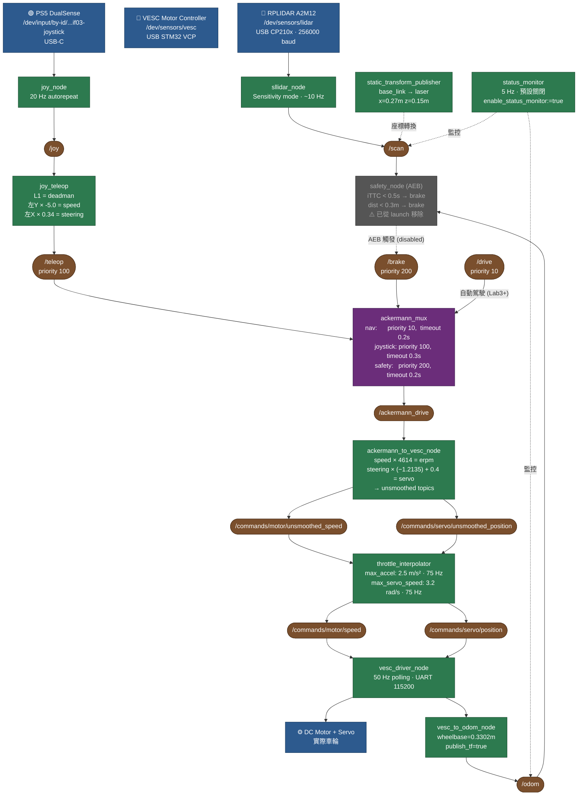

# F1Tenth System Architecture



## 優先權與時序

| 控制來源 | Topic | 優先權 | Timeout |
|---------|-------|--------|---------|
| Safety (AEB) | `/brake` | **200** | 0.2s |
| 搖桿 | `/teleop` | 100 | 0.3s |
| 自動駕駛 | `/drive` | 10 | 0.2s |

| 節點 | 頻率 |
|------|------|
| RPLIDAR 掃描 | ~10 Hz |
| joy_node 輸出 | 20 Hz autorepeat |
| VESC telemetry polling | 50 Hz |
| throttle_interpolator | 75 Hz |
| status_monitor | 5 Hz |

## 關鍵參數

| 參數 | 值 |
|------|-----|
| ERPM gain | 4614.0 erpm / (m/s) |
| Servo gain | −1.2135 / rad |
| Servo offset | 0.4 |
| Servo 範圍 | 0.15 ~ 0.85 |
| Speed 範圍 | ±23250 erpm |
| Wheelbase | 0.3302 m |
| Throttle max accel | 2.5 m/s² |
| Servo max speed | 3.2 rad/s |
| LiDAR TF (x, z) | 0.27 m, 0.15 m |
| AEB TTC 閾值 | 0.5 s（disabled）|

## Throttle Interpolator 說明

`ackermann_to_vesc_node` 的輸出不直接進 `vesc_driver`，而是先經過 `throttle_interpolator` 做平滑：

```
ackermann_to_vesc → /commands/motor/unsmoothed_speed
                  → /commands/servo/unsmoothed_position
                        ↓
               throttle_interpolator
                        ↓
                  /commands/motor/speed
                  /commands/servo/position
                        ↓
                  vesc_driver_node
```

## Safety Node 狀態

`safety_node` (AEB) 已完全從 `bringup_launch.py` 移除（小場地、低速不需要）。
如要啟用，重新引入 `Node(package='safety_node', ...)` 並加回 `ld.add_action(...)`。

## Status Monitor

預設**不啟動**以節省 CPU。要開啟：
```bash
ros2 launch f1tenth_stack bringup_launch.py enable_status_monitor:=true
```

## 腳本目錄結構

頂層只保留 bringup / kill 入口，其餘全部進 `scripts/`：

```
/mnt/nvme/f1tenth_ws/
├── bringup.sh                 # 主入口（alias: f1start）
├── kill_all.sh                # 強制清乾淨所有 ROS 進程
└── scripts/
    ├── record_track.sh        # SLAM + waypoints 兩階段錄製
    ├── record_waypoints.sh    # 用已存地圖重新錄 waypoints
    ├── slam_diag.sh           # SLAM pipeline 診斷
    ├── start_sim_bridge.sh    # AutoDRIVE 模擬橋接
    ├── verify_lidar.py        # LiDAR 方向驗證
    └── archive/               # 舊版腳本（確認無誤後可刪）
```

### 工作流程

| 情境 | 指令 | 前置 |
|---|---|---|
| 啟動車輛 | `f1start` (= `./bringup.sh`) | — |
| 第一次錄地圖+路徑 | `./scripts/record_track.sh <name>` | f1start 已跑 |
| 用既有地圖補錄 waypoints | `./scripts/record_waypoints.sh <name>` | f1start 已跑，`maps/<name>.{posegraph,data}` 存在 |
| 診斷 SLAM 狀態 | `./scripts/slam_diag.sh` | f1start + SLAM 跑中 |
| 驗證 LiDAR 方向 | `python3 scripts/verify_lidar.py` | f1start 已跑 |
| 清光所有 ROS 進程 | `./kill_all.sh` | — |
| 啟動模擬 | `./scripts/start_sim_bridge.sh` | — |

### 檔案命名規範（per-track 資料夾）

每個 track 一個資料夾，結構固定：

```
maps/<name>/
├── map.{pgm,yaml}         # Occupancy grid (PF + SLAM localization 共用)
├── slam.{posegraph,data}  # slam_toolbox serialized pose graph
├── waypoints.csv          # Pure Pursuit / MPC 用
└── debug/                 # 原始 waypoint、overlay png、備份
```

所有腳本吃 `<name>` 裸名，自動解析 `maps/<name>/...`。
舊的 `waypoints/` 只保留 `archive/` 為歷史檔；新錄的都進 `maps/<name>/`。

### 四階段 Pipeline

| 階段 | 職責 | Package | 啟動 |
|---|---|---|---|
| 1. 建圖 | SLAM mapping | `slam_toolbox` (via `f1tenth_stack`) | `record_track.sh` |
| 2. 定位 | Particle Filter | `particle_filter` | `run_pf_mpc.sh` 內含 |
| 3. 規劃 | Pure Pursuit | `pure_pursuit` | `run_pf_pp.sh` |
| 4. 控制 | MPC | `mpc_controller` | `run_pf_mpc.sh` / `run_mpc.sh` |

不屬於以上的 package 全部放 `src/archive/`（有 `COLCON_IGNORE`）。
